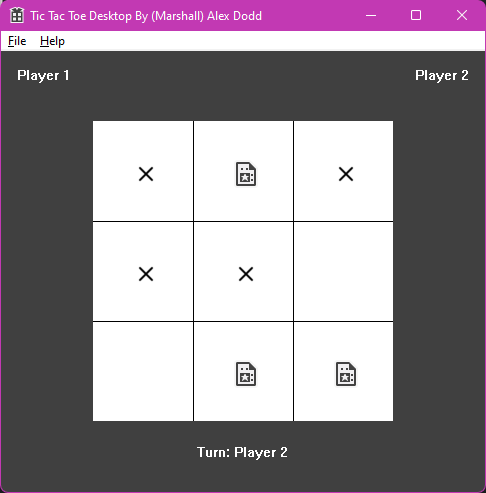
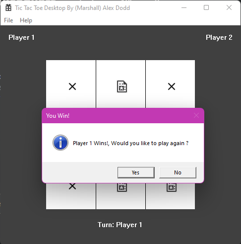

# TicTacToe

Erm. Hi?

## Description

This originally started out as a console TicTacToe application for a university assignment, then as if a bolt of energy hit me i decided to make it have a proper GUI. So yea, thats all this project is, a simple TicTacToe game using the standard C++ Window VS Project Template.

I think i got a A for this assignment, but i cant remember.

## Images

